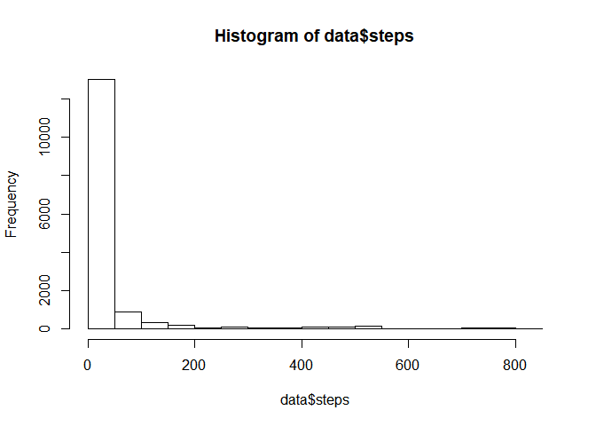

## Loading and preprocessing the data

To load and process the data the first step is to download the data from the url, what can be achieve using the `download.file() and read.csv()` functions. The code used to perform this activity is the following:


```r
url <- "https://d396qusza40orc.cloudfront.net/repdata%2Fdata%2Factivity.zip"
download.file(url,"activity.zip")
unzip("activity.zip")
data <- read.csv("activity.csv")
```

## What is mean total number of steps taken per day?

To identify the mean of the number of steps we can use the function `summary()` on the variable `steps` of our database. `summary(data$steps)`.


We can further investigate this making a histogram of the steps so we can have some information about its distribution.


```r
hist(data$steps)
```

<!-- -->


We can see from the histogram that a large part of the observations have a number of steps equal or close to zero. This means that we might have some observations with a register of steps a lot bigger thant the mean value of `37.38`.

## What is the average daily activity pattern?


## Imputing missing values
sum(is.na(data$steps))


## Are there differences in activity patterns between weekdays and weekends?
